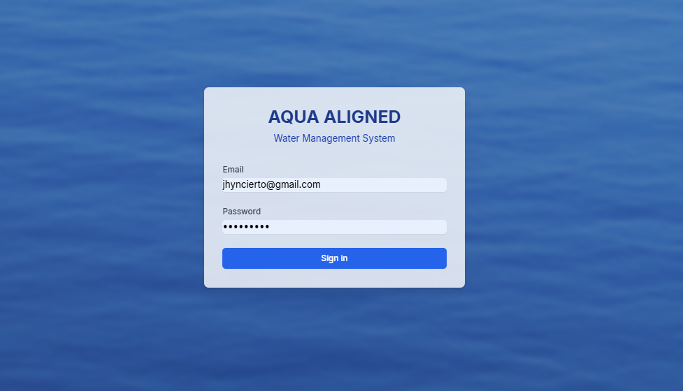
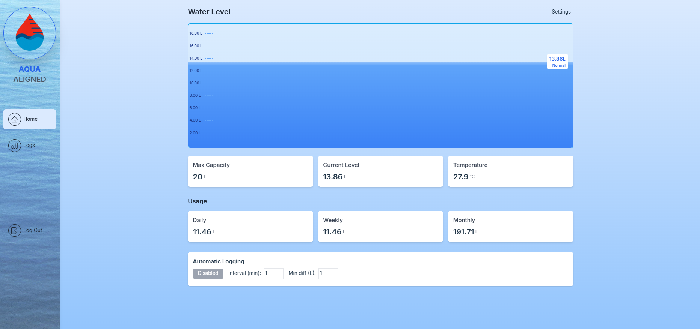
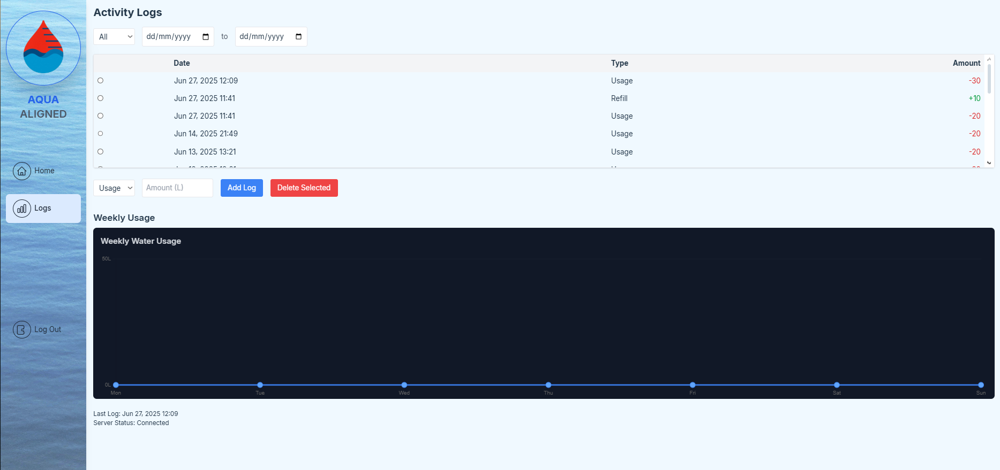
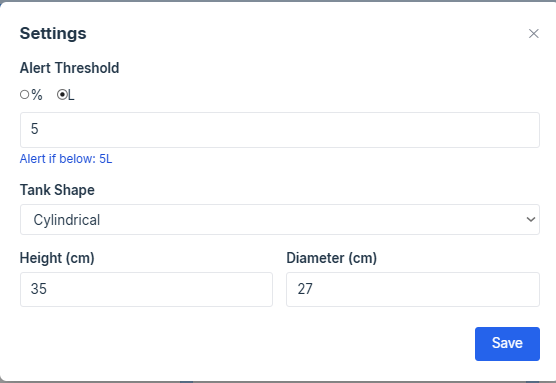

# AquaAligned User Manual

**AquaAligned** is a web-integrated IoT application that enables users to monitor water tank levels and temperature in real-time. By leveraging sensor data and automated logging, the system helps prevent overflows, detect usage patterns, and promote smarter water management through an intuitive dashboard and historical tracking.

---

## ✅ Features

- 🌊 Real-Time Tank Monitoring: Displays current water level and temperature using an ultrasonic and temperature sensor.
- 📈 Auto Logging: Automatically logs usage or refills based on detected changes.
- 📅 Usage Tracker: Tracks daily, weekly, and monthly usage statistics.
- 🔔 Threshold Alerts: Sends a visual and audio alert when water level drops below the configured threshold.
- ⚙️ Smart Settings: Customize tank shape, dimensions, and logging preferences.
- 🔐 Login System: Secure login to access your personalized dashboard.

---

## 🔁 How It Works

1. **HC-SR04 ultrasonic sensor** and **DS18B20 temperature sensor** collect water data.
2. Data is transmitted via **ESP32/NodeMCU** to a backend server.
3. The backend updates a **MySQL** database.
4. The **React + Vite** frontend fetches and displays this data in real time.
5. Users can **configure settingss, and monitor alerts** via the Dashboard or **Create, View, Search, and Delete logs, and view a weekly log chart**
   in Logs View.

---

## 🖱 How to Use(Local Setup)
1. Download the zip file
2. Download and impot the database file and name the database "aquaaligned"
3. Open VS code
4. Install dependencies (npm install)
5. Connect IoT Device via USB A to C data cable
6. Download and open sketch file, change the ssid and password to your WiFi's, and the IP in serverUrl to match your Ip address
7. Run the Server (node server.cjs)
8. Run the Frontend (npm run dev)
9. Access the App

---

## Screenshots of working prototype

